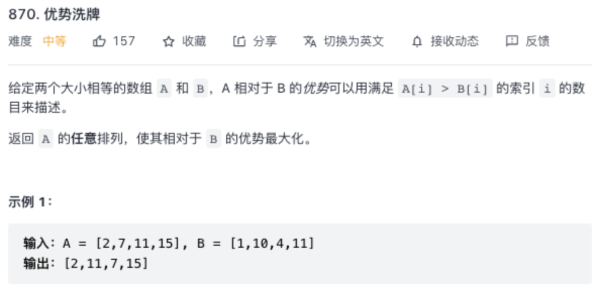

### 优势洗牌

原题：https://leetcode-cn.com/problems/advantage-shuffle/



#### 双指针

```js
/**
 * @param {number[]} nums1
 * @param {number[]} nums2
 * @return {number[]}
 */
var advantageCount = function(nums1, nums2) {
    // todo
    // nums2 为参考点，不能排序？转换一下对数组 index 进行排序
    // 双指针进行比拼， A 比不过就舍弃给 B 最牛的，否则就比拼到底
};
```