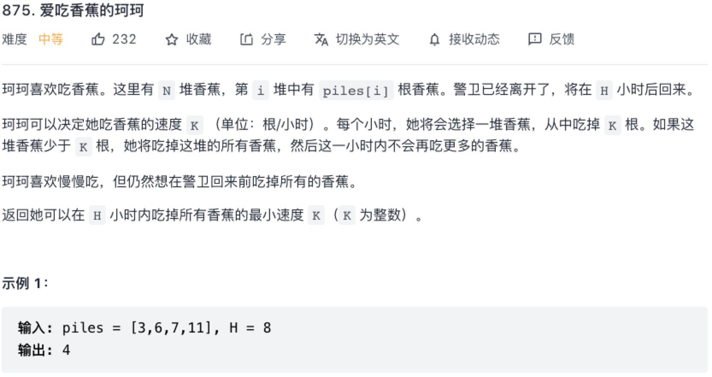

## 二分查找

### 爱吃香蕉的珂珂

原题：https://leetcode-cn.com/problems/koko-eating-bananas/



```js
/**
 * @param {number[]} piles
 * @param {number} h
 * @return {number}
 */
var minEatingSpeed = function(piles, h) {
    // 每小时吃 x 根香蕉，吃完所有香蕉所用时间
    function spendHours(x) {
        let hours = 0;
        for (let i = 0; i < piles.length; i++) {
            hours += Math.ceil(piles[i] / x);
        }
        return hours;
    }
    // 暴力法，从第一个香蕉开始遍历，直到 piles 的最大值（最快速度就是 Math.max(...piles)）
    // let max = Math.max.apply(null, piles)
    // for (let i = 1; i <= max; i++) {
    //     if (spendHours(i) <= h) {
    //         return i;
    //     }
    // }

    // 二分查找
    let left = 1, right = Math.pow(10, 9); // 任一堆可能的最大值
    while (left <= right) {
        let mid = left + Math.floor((right - left) / 2);
        if (spendHours(mid) <= h) {
            right = mid - 1;
        } else if (spendHours(mid) > h) {
            left = mid + 1;
        }
    }
    return left;
};
```

### 在 D 天内送达包裹的能力

原题：https://leetcode-cn.com/problems/capacity-to-ship-packages-within-d-days/

其实是和上一题类似的提醒，主要是计算当运载能力为 x 时，需要 spendDays(x) 天运完所有货物

```js
/**
 * @param {number[]} weights
 * @param {number} days
 * @return {number}
 */
var shipWithinDays = function(weights, days) {
    // x 为货船的运输能力
    function spendDays(x) {
        let count = 0;
        let D = 1;
        for (let i = 0; i < weights.length; i++) {
            if (count + weights[i] > x) {
                D++;
                count = weights[i];
            } else {
                count += weights[i];
            }
        }

        return D;
    }

    let max = 0;
    let left = 0;
    for (let i = 0; i < weights.length; i++) {
        max += weights[i];
        left = Math.max(left, weights[i]);
    }
    right = max;

    while (left <= right) {
        let mid = left + Math.floor((right - left) / 2);
        if (spendDays(mid) <= days) {
            right = mid - 1;
        } else if (spendDays(mid) > days) {
            left = mid + 1;
        }
    }

    return left;
};
```