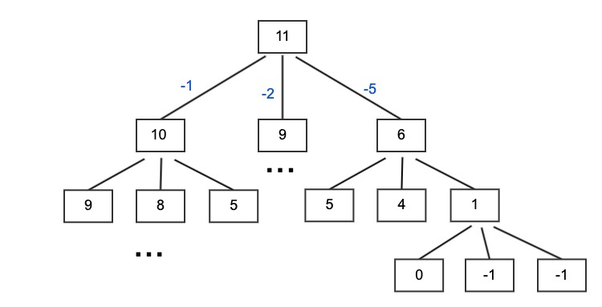

### 零钱兑换
原题见 https://leetcode-cn.com/problems/coin-change/

给定不同面额（k 种面额）的硬币 coins 和一个总金额 amount。编写一个函数来计算可以凑成总金额所需的最少的硬币个数。如果没有任何一种硬币组合能组成总金额，返回 -1。

示例 1:
输入: coins = [1, 2, 5], amount = 11
输出: 3 
解释: 11 = 5 + 5 + 1

#### 暴力法
题意是每种硬币数量都满足需求，且相互独立。

这种求最值问题我想到的是递归求解，思路是将问题拆解，即有三种情况：依次循环 coins，当 coins[coin} 时，下次递归应该就是 amount - coins[coin]，用题中例子 amount = 11 时的最少硬币数来说明加深理解，如果能凑出 amount = 10 的最少硬币数（子问题），则只需要把子问题的答案加一（再选一枚面值为 1 的硬币）就是原问题的答案，以此类推，便于理解请参考如下图：


递归思路找到了，递归出口，当 amount 为 0 时，则不需要凑硬币，即为 0，当递归到 amount 小于 0 时，则说明没有找到凑硬币方法，按题意返回 -1。

暴力法输出如下：
```js
/**
 * @param {number[]} coins
 * @param {number} amount
 * @return {number}
 */
var coinChange = function(coins, amount) {
    const dp = function(subAmount) {
        if (subAmount === 0) return 0;
        if (subAmount < 0) return -1;
        let res = amount + 1;
        for (let coin in coins) {
            let partial = dp(subAmount - coins[coin]);
            if (partial === -1) continue;
            res = Math.min(res, partial + 1);
        }

        res = res === amount + 1 ? -1 : res;
        return res;
    }

    return dp(amount);
};
```

### 备忘递归（暴力法的优化）
由上图可以发现，不少的节点的递归返回值是一样的，那么可以将其作为 cache，代码如下：
```js
var coinChange = function(coins, amount) {
    let cache = {};
    const dp = function(subAmount) {
        if (subAmount === 0) return 0;
        if (subAmount < 0) return -1;
        if (cache[subAmount] !== undefined) return cache[subAmount];
        let res = amount + 1;
        for (let coin in coins) {
            let partial = dp(subAmount - coins[coin]);
            if (partial === -1) continue;
            res = Math.min(res, partial + 1);
        }

        res = cache[subAmount] = res === amount + 1 ? -1 : res;
        return res;
    }

    return dp(amount);
};
```

> 以上，递归需要的时间复杂度是O(N^k)，而递归里边的循环时间复杂度是O(K)，所以总的时间复杂度是O(k*N^k)。空间复杂度O(N)。

### 动态规划法

动态规划计算规则则是与以上方法相反，以从下往上来消除重叠的子问题求解。

明确一下 dp[i] 为至少 K 玫硬币才能拼凑成 i 的金额。

**临界出口：**
当 i=0 时，dp[0] = 0；
当 i<0 时，dp[i] = -1；
否则，dp[i] = Math(dp[i-coins[coin]]+1, dp[i]);

代码如下：
```js
/**
 * @param {number[]} coins
 * @param {number} amount
 * @return {number}
 */
var coinChange = function(coins, amount) {
    // dp[i] 为至少 K 玫硬币才能拼凑成 i 的金额。
    let dp = new Array(amount+1).fill(amount+1);
    dp[0] = 0;
    for (let i=1; i <= amount; i++) {
        for (let j=0, len=coins.length; j<len;j++) {
            if (i-coins[j] < 0) continue;
            dp[i] = Math.min(dp[i-coins[j]]+1, dp[i]);
        }
    }

    dp[amount] = dp[amount] === amount + 1 ? -1 : dp[amount];
    return dp[amount];
};
```

> 时间复杂度O(N*k)，空间复杂度O(N)