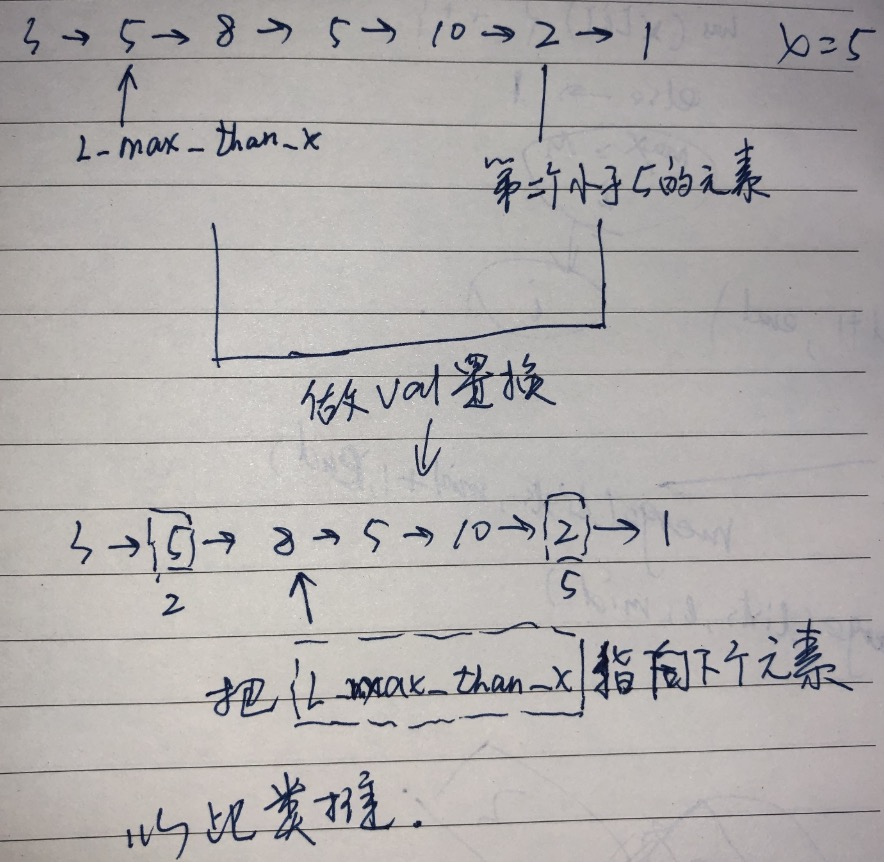

原题 https://leetcode-cn.com/problems/partition-list-lcci/

> 编写程序以 x 为基准分割链表，使得所有小于 x 的节点排在大于或等于 x 的节点之前。如果链表中包含 x，x 只需出现在小于 x 的元素之后(如下所示)。分割元素 x 只需处于“右半部分”即可，其不需要被置于左右两部分之间。

**示例:**
```
输入: head = 3->5->8->5->10->2->1, x = 5
输出: 3->1->2->10->5->5->8
```


```js
/**
 * Definition for singly-linked list.
 * function ListNode(val) {
 *     this.val = val;
 *     this.next = null;
 * }
 */
/**
 * @param {ListNode} head
 * @param {number} x
 * @return {ListNode}
 */
var partition = function(head, x) {
    if(head === null){
        return null;
    }

    let cur = head;
    let l_max_than_x = head;

    while(cur){
        if(cur.val < x){
            let tmp = cur.val;
            cur.val = l_max_than_x.val;
            l_max_than_x.val = tmp;
            l_max_than_x = l_max_than_x.next;
        }

        cur=cur.next;
    }
    return head;
};
```
