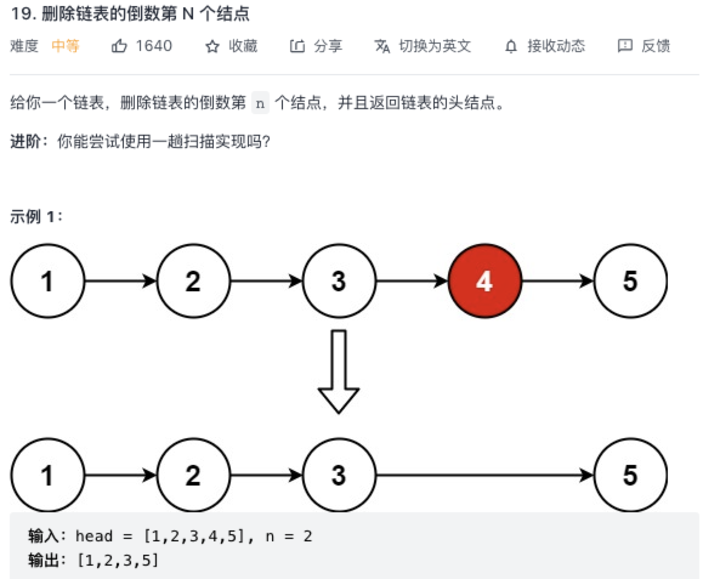

### 删除链表的倒数第 N 个结点

原题：https://leetcode-cn.com/problems/remove-nth-node-from-end-of-list/



#### 单链表的倒数第 k 个节点 题的拓展

转换成找到单链表的倒数第 k+1 个节点即可，注意要考虑到边界溢出，引入了头结点。

```js
/**
 * Definition for singly-linked list.
 * function ListNode(val, next) {
 *     this.val = (val===undefined ? 0 : val)
 *     this.next = (next===undefined ? null : next)
 * }
 */
/**
 * @param {ListNode} head
 * @param {number} n
 * @return {ListNode}
 */
var removeNthFromEnd = function(head, n) {
    let dummy = new ListNode();
    dummy.next = head;
    let former = dummy;
    let latter = dummy;
    
    for (let i = 0; i < n + 1; i++) {
        former = former.next;
    } 

    while (former !== null) {
        former = former.next;
        latter = latter.next;
    }

    latter.next = latter.next.next;

    return dummy.next;
};
```