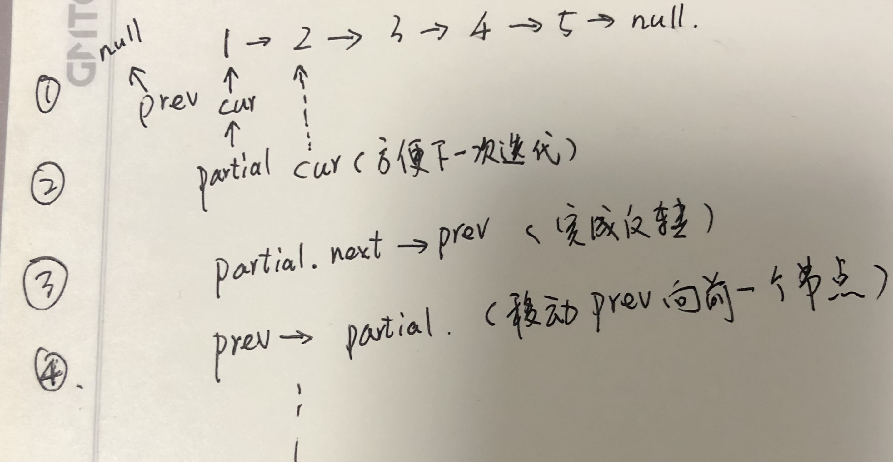

### 反转链表（reverse-linked-list）

原题见：https://leetcode-cn.com/problems/reverse-linked-list/

示例:
输入: 1->2->3->4->5->NULL 
输出: 5->4->3->2->1->NULL

#### 递归
对于链表的操作，最简单最先想到的就是递归操作了。常用的递归套路如：
```JS
let doXxLinkedList = (root: TreeNode) => {
  // 这里判断临界条件，做相应的操作
  doXxLinkedList(root.next);
  doXxLinkedList(root.prev);
};
```

而本题是做反转操作，只需将后一节点指向前一节点即可。

根据递归的套路，我们认为某个节点后的所有节点经过递归都已经完成反转，如例子，当递归到某一个节点 i，i+1 后边的节点都已经完成反转，只需要将 i+1的节点指向 i 的节点即可。其实最需要注意的就是边界条件，本题对于每一个递归方程，其头结点都应该为 null。

代码如下：
```js
/**
 * Definition for singly-linked list.
 * function ListNode(val) {
 *     this.val = val;
 *     this.next = null;
 * }
 */
/**
 * @param {ListNode} head
 * @return {ListNode}
 */
var reverseList = function(head) {
    if (head === null || head.next === null) return head;
    let subList = reverseList(head.next);
    head.next.next = head;
    head.next = null;
    return subList;
};
```

> 时间和空间复杂度都是O(n)

#### 迭代
通过迭代来改变前后节点指针指向，其实可以借助外部条件，设置一下临时的节点，参考下一草图来说明：


设置 partial 变量始终指向当前要操作的节点，那么得先挪动下一节点的指向（cur）供下一次操作，在完成当前节点指向 prev 后，也将 prev 向前挪动进行下次迭代。

```js
var reverseList = function(head) {
    let prev = null, cur = head, partial = null;
    while (!!cur) {
        partial = cur;
        cur = cur.next;
        partial.next = prev;
        prev = partial;
    }
    return partial;
};
```

> 时间复杂度和前一解法一样，是 O(n), 空间复杂度是O(1)