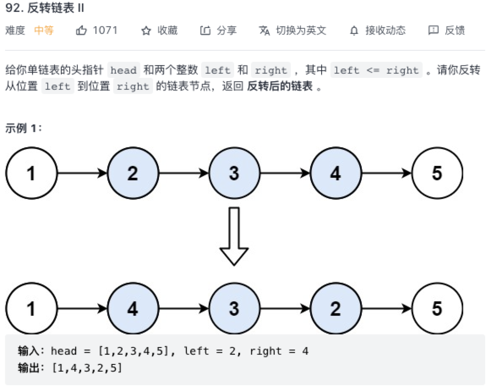

### 反转链表②

原题：https://leetcode-cn.com/problems/reverse-linked-list-ii/



### 递归法

```js
/**
 * Definition for singly-linked list.
 * function ListNode(val, next) {
 *     this.val = (val===undefined ? 0 : val)
 *     this.next = (next===undefined ? null : next)
 * }
 */
/**
 * @param {ListNode} head
 * @param {number} left
 * @param {number} right
 * @return {ListNode}
 */
var reverseBetween = function(head, left, right) {
    if (left == 1) return reverseN(head, right);
    // 这里也是递归的方式解决问题，其实可以for循环走到left节点处
    // 注意需要对head.next重新赋值，否则链表就断开了。
    head.next = reverseBetween(head.next, left - 1, right - 1);
    return head;
};

function reverseN(head, n) {
    // 需要全局存下N+1个节点
    if (n === 1) {
        successor = head.next;
        return head;
    }
    let last = reverseN(head.next, n - 1);
    head.next.next = head;
    // 和全部反转的区别就在这里，全部反转head就是最后一个节点，head.next=null
    // 反转前N个节点，头结点的会连上N+1个节点，即head.next=successor
    head.next = successor;
    return last;
}
```

#### 迭代
```js
var reverseBetween = function(head, left, right) {
    // 头插迭代法
    let dummyHead = new ListNode();
    dummyHead.next = head;
    let prev = cur = dummyHead;
    for (let i = 0; i < left - 1; i++) {
        cur = cur.next;
        prev = cur;
    }

    cur = cur.next;
    while (left < right) {
        let next = cur.next;
        cur.next = next.next;
        next.next = prev.next;
        prev.next = next;
        left++;
    }

    return dummyHead.next;
};
```

两种方法都是 O(N) 的时间复杂度，递归需要明确当前方法要做什么以及base case，头插法这种迭代方式，过于考验细节。