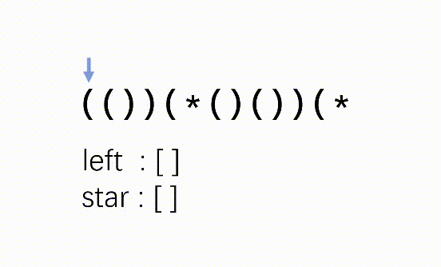

### 有效的括号字符串

原题：https://leetcode-cn.com/problems/valid-parenthesis-string/

```js
/**
 * @param {string} s
 * @return {boolean}
 */
var checkValidString = function(s) {
    let left = [], star = [];
    for (let i = 0; i < s.length; i++) {
        if (s.charAt(i) === '(') left.push(i); 
        if (s.charAt(i) === '*') star.push(i);
        if (s.charAt(i) === ')') {
            if (left.length > 0) {
                left.pop();
            } else if (star.length > 0) {
                star.pop();
            } else {
                return false;
            }
        }
    }
    if (star.length < left.length) {
        return false;
    }

    while (left.length > 0) {
        if (left.pop() > star.pop()) return false;
    }

    return true;
};
```


<center>图片截取至：https://leetcode-cn.com/problems/valid-parenthesis-string/solution/you-xiao-de-gua-hao-zi-fu-chuan-xian-jian-ce-you-g/</center>