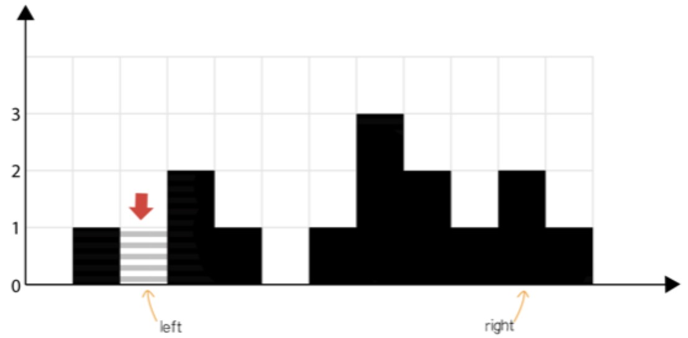

### 雨水收集

> 原题见：https://leetcode-cn.com/problems/trapping-rain-water/


#### 暴力法
首先我不排斥暴力法，至少说明理解了题意并且有解决办法。

如图，如需要获取第 i 个柱子能装下的雨水，需要在其左右都有比它高的柱子，即其左边最高的柱子和其右边最高的柱子围起来建立的“水池”高度 - 自身高度，则为该柱子能获取到的雨水量。

暴力法即根据题意去写代码，如下：
```JS
/**
 * @param {number[]} height
 * @return {number}
 */
var trap = function(height) {
    let len = height.length;
    let ans = 0;
    for (let i = 0; i < len; i++) {
        let lMax = 0, rMax = 0;
        // 通过变量记录其左边的最高柱子
        for (let m = i; m >= 0; m--) {
            lMax = Math.max(lMax, height[m]);
        }
        // 通过变量记录其右边的最高柱子
        for (let k = i; k < len; k++) {
            rMax = Math.max(rMax, height[k]);
        }
        ans += Math.min(lMax, rMax) - height[i];
    }

    return ans;
};
```
> 时间复杂度为 O(n^2)，空间复杂度为 O(1)

### 动态规划
根据以往 dp 经验，可以把 i 左右最大高度柱子暂存起来以供遍历使用。

从左至右遍历 i 左边最大的高度方程为：lMax[i] = Math.max(lMax[i-1], height[i])

从右到左遍历 i 右边最大的高度方程为：rMax[i] = Math.max(rMax[i+1], height[i])

那么迭代方程式可以是所有 `Math.min(lMax[i], rMax[i]) − height[i]` 的和。

代码就好写了，如下：
```JS
/**
 * @param {number[]} height
 * @return {number}
 */
var trap = function(height) {
    let len = height.length;
    let ans = 0;
    let lMax = new Array(len);
    let rMax = new Array(len);
    lMax[0] = height[0];
    rMax[len-1] = height[len-1];
    for (let i = 1; i < len; i++) {
        lMax[i] = Math.max(lMax[i-1], height[i]);
    }
    for (let i = len - 2; i >= 0; i--) {
        rMax[i] = Math.max(rMax[i+1], height[i]);
    }
    for (let i = 0; i < len; i++) {
        ans += Math.min(lMax[i], rMax[i]) - height[i];
    }

    return ans;
};
```
> 时间\空间复杂度为 O(n)

### 使用双指针
使用双指针即从左右往中间遍历的过程，如用 left、right 来标识这两个指针，相对动态规划解题思路也算的上是一个比较取巧的思路。

当 left 由左往右遍历时，当遍历到具体的某个 left 指针，其左边最大高度的柱子（lMax）如果小于 right 对应柱子高度，则能确定该 left 指针对应柱子的可收集雨水，即 lMax - height[left]。

同理，对应 right 指针，其右边最大柱子（rMax）如果小于 left 对应柱子高度，则能确定该 right 指针对应柱子可收集的雨水，即 rMax - height[right]。



借助上面的图来理解（注：该图截图于 leetcode）。当遍历到 left，只要 right 对应柱子高度大于 left 左边所有柱子高度，则其收集雨水量一定是由 lMax 决定。相对于 right 也类似。

代码如下：
```JS
/**
 * @param {number[]} height
 * @return {number}
 */
var trap = function(height) {
    let len = height.length;
    let ans = 0;
    let left = 0;
    let right = len - 1;
    let lMax = height[0];
    let rMax = height[len-1];
    
    while (left <= right) {
        lMax = Math.max(lMax, height[left]);
        rMax = Math.max(rMax, height[right]);
        if (lMax < height[right]) {
            ans += lMax - height[left];
            left++;
        } else {
            ans += rMax - height[right];
            right--;
        }
    }

    return ans;
};
```
> 时间复杂度是O(n)，空间复杂度为O(1)，只需要常量的空间。