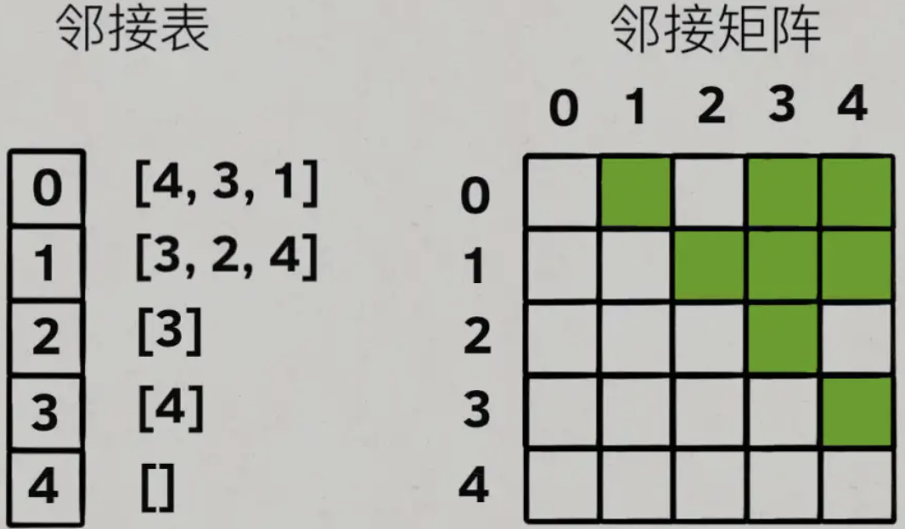

# graph

图是我们现实生活中连接关系的抽象，例如朋友圈、微博的关注关系。

图论中的很多问题都可以使用「深度优先搜索」或者「广度优先搜索」完成。

如图：


**图常见的存储方式**

- 邻接表，是一中较为直观的方式，即把每个节点 x 的邻居都存到一个列表里，然后把 x 和这个列表关联起来，这样就可以通过一个节点 x 找到它的所有相邻节点。
- 邻接矩阵则，是一个二维布尔数组假设为 matrix，如果节点 x 和 y 是相连的，那么就把 matrix[x][y] 设为 true，也就是说如果想找节点 x 的邻居，去扫一圈matrix[x][..]就行了。

参考如下图（无向图）



### 所有可能的路径

原题：https://leetcode-cn.com/problems/all-paths-from-source-to-target/

#### 递归(DFS)

图的遍历套用框架

```js
function traversal (graph, key) {
    if (graph.length === 0) return;
    // ...
    let item = graph(key);
    for (val of item) {
        // ...
        traversal(val);
        // ...
    }
}
```

题解如下：

```js
/**
 * @param {number[][]} graph
 * @return {number[][]}
 */
var allPathsSourceTarget = function(graph) {
    let ans = [], stack = [];
    let graphLen = graph.length;

    const traversal = (key) => {
        // console.log(key,';', ans, ';', stack);
        if (key === graphLen - 1) ans.push(stack.slice());
        let item = graph[key];
        let len = item.length;
        if (len === 0) return;
        for (val of item) {
            stack.push(val);
            traversal(val);
            stack.pop();
        }
    }

    stack.push(0);
    traversal(0);
    
    return ans;
};
```