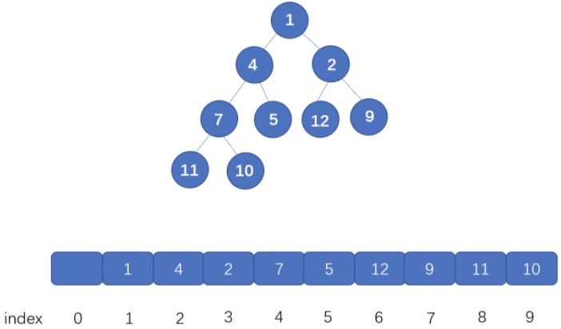

### 堆（Heap）

堆（Heap）是一个可以被看成近似完全二叉树的数组，树上的每一个结点对应数组的一个元素。除了最底层外，该树是完全充满的，而且是从左到右填充。—— 来自：《算法导论》

满足二叉堆的要求：
- 二叉堆必须是完全二叉树；
- 二叉堆中的每一个节点，都必须大于等于（或小于等于）其子树中每个节点的值。

堆包括最大堆和最小堆：
- 最大堆的每一个节点（除了根结点）的值不大于其父节点；
- 最小堆的每一个节点（除了根结点）的值不小于其父节点。

树上的每一个结点对应数组的一个元素，为什么我们可以用数组来存储堆呢？


<center>https://pic.leetcode-cn.com/1615870575-Ubyzzb-file_1615870575038</center>

先看根节点，也就是值为 1 的节点，它在数组中的下标为 1，它的左子节点，也就是值为 4 的节点，此时索引为 2，右子节点也就是值为 2 的节点，它的索引为 3。

由此找到其中的对应关系：

数组中，某节点（非叶子节点）的下标为 i，那么其左子节点下标为 2*i （这里可以直接通过相乘得到左孩子，如果从 0 开始存，需要 2i+1 才行）, 右子节点为 2i+1。孩子节点的父节点为 Math.floor(i/2)。既然我们完全可以根据索引找到某节点的左右子节点，那么用数组存储是完全没有问题的。

堆常见的操作：

- HEAPIFY 建堆：把一个乱序的数组变成堆结构的数组，时间复杂度为 O(n)；
- HEAPPUSH：把一个数值放进已经是堆结构的数组中，并保持堆结构，时间复杂度为 O(log n)；
- HEAPPOP：从最大堆中取出最大值或从最小堆中取出最小值，并将剩余的数组保持堆结构，时间复杂度为 O(log n)；
- HEAPSORT：借由 HEAPIFY 建堆和 HEAPPOP 堆数组进行排序，时间复杂度为 O(nlog n)，空间复杂度为 O(1).

堆结构的一个常见应用是建立优先队列（Priority Queue）。

#### HEAPIFY（创建一个大「小」顶堆）
常见的创建操作有两种：插入式建堆和原地创建

堆化统一用到的 swap 方法如下：
```js
function swap(items, i, j) {
    let temp = items[i]
    items[i] = items[j]
    items[j] = temp
}
```

**1. 插入式建堆**
- 将节点插入（push）到队尾；
- 遵循自下往上堆化的过程，即将插入节点与其父节点比较，如果插入节点大于父节点（大顶堆）或插入节点小于父节点（小顶堆），则插入节点与父节点调整位置；
- 重复上一步，直到根节点为止。
```js
function insert(index) {
    while (index > 1 && nums[Math.floor(index/2)] > nums[index]) {
        swap(Math.floor(index/2), index); //交换
        index = Math.floor(index/2);
    }
}
```

**2. 原地堆化**

1）将节点与其父节点比较，如果节点大于父节点（大顶堆）或节点小于父节点（小顶堆），则节点与父节点调整位置
```js
function buildHeap(nums) {
    for (let i = 1; i <= nums.length; i++) {
        heapify(nums, i);
    }
}
// 原地堆化成一个小顶堆
function heapify(items, i) {
    // 自下而上式堆化
    while (Math.floor(i/2) > 0 && items[i] < items[Math.floor(i/2)]) {  
        swap(items, i, Math.floor(i/2)); // 交换 
        i = Math.floor(i/2); 
    }
} 
```

2）将节点与其左右子节点比较，如果存在左右子节点大于该节点（大顶堆）或小于该节点（小顶堆），则将子节点的最大值（大顶堆）或最小值（小顶堆）与之交换
```js
function buildHeap(nums) {
    let len = nums.length;
    // 找到最后一个非叶子节点，开始遍历并堆化
    for (let i = Math.floor(len / 2); i > 0; i--) {
        heapify1(nums, i, len);
    }
}
// 原地堆化成一个小顶堆
function heapify1(nums, index, len) {
    while (true) {
        let minIndex = index;
        // 找到子节点中最小的节点
        if (2 * index <= len && nums[index] > nums[2 * index]) {
            minIndex = 2 * index;
        }
        if (2 * index + 1 <= len && nums[minIndex] > nums[2 * index + 1]) {
            minIndex = 2 * index + 1;
        }
        if (minIndex === index) break;
        swap(nums, minIndex, index);
        index = minIndex;
    }
}
```

> 建堆的时间复杂度为 O(n）

#### Reference
- [堆排序、Top K、中位数等问题](https://github.com/sisterAn/JavaScript-Algorithms/issues/60)
- [堆排序](https://github.com/chefyuan/algorithm-base/blob/main/animation-simulation/%E6%95%B0%E6%8D%AE%E7%BB%93%E6%9E%84%E5%92%8C%E7%AE%97%E6%B3%95/%E5%A0%86%E6%8E%92%E5%BA%8F.md)
