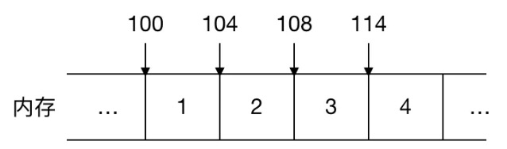

### 链表
链表是一种物理存储单元上非连续、非顺序的存储结构，数据节点的逻辑顺序是通过链表中的指针链接次序实现的，其中每个结点包括数据和指针。

由于不必须按顺序存储，链表在插入的时候可以达到O(1)的复杂度，但是查找一个节点或者访问特定编号的节点则需要O(n)的时间。

#### 与数组的比较
数组是由相同类型元素的集合所组成的数据结构，分配一块连续的内存来存储，如下图：


***读取性能*
可以看到数组的每个元素都是连续紧邻分配的，这叫连续性，同时由于数组的元素占用的大小是一样的，在 Java 中 int 型大小固定为 4 个字节，所以如果数组的起始地址是 100， 由于这些元素在内存中都是连续紧邻分配的，大小也一样，可以很容易地找出数组中任意一个元素的位置，比如数组中的第三个元素起始地址为 100 + 2 * 4 = 108，这就叫顺序性。读取的时间复杂度是O(1)，效率很高。

而链表则需要从头遍历整条链路，时间复杂度为O(n)。

> 在一些动态语言中例如 Python 的列表或者 JavaScript 的数组都可能是非连续性的内存，也可以存储不同类型的元素。

**关于删除或者新增数据**
对于数组来说，如果要删除某个元素，则先删掉该元素，同时需要把后续的元素往前一个个移动，新增数据也是类似。如果涉及到元素的频繁删除和插入，用链表相对来说高效很多，因为仅仅需要修改指针的指向即可。
```js
/** 
  输入: head = [4,5,1,9], node = 5
  输出: [4,1,9]
  解释: 给定你链表中值为 5 的第二个节点，那么在调用了你的函数之后，该链表应变为 4 -> 1 -> 9.
  来源：https://leetcode-cn.com/problems/delete-node-in-a-linked-list
*/
var deleteNode = function(node) {
    node.val = node.next.val;
    node.next = node.next.next;
};
```

**大内存空间分配**
由于数组空间的连续性，如果要为数组分配大额的存储空间，则要求这些的空间必须是连续的，未被占用的，具有较高的内存分配要求，如果内存碎片太多，分配连续的大空间很可能导致失败。而链表由于是非连续的，所以大内存空间分配情况下选择链表更合适。

***访问局部性*
在计算机科学领域，访问局部性（英语：Locality of reference）指的是应用程序在访问内存的时候，倾向于访问内存中较为靠近的值。具体可以参考 wiki [访问局部性](https://zh.wikipedia.org/wiki/%E8%AE%BF%E9%97%AE%E5%B1%80%E9%83%A8%E6%80%A7)。对于数组，空间局部性则发挥其作用，空间局部性指的是，最近引用过的内存位置以及其周边的内存位置容易再次被使用。CPU 运行速度是非常快的，如果 CPU 每次运算都要到内存里去取数据那就太耗时了，所以当访问过数组某一项数据后，周边的元素也相应的具备了局部缓存，从而提升了访问速度。

相对来说，数组在访问局部性这一块较链表更具优势。

#### 链表结构
具体直接参考wiki [链表结构](https://zh.wikipedia.org/wiki/%E9%93%BE%E8%A1%A8)
