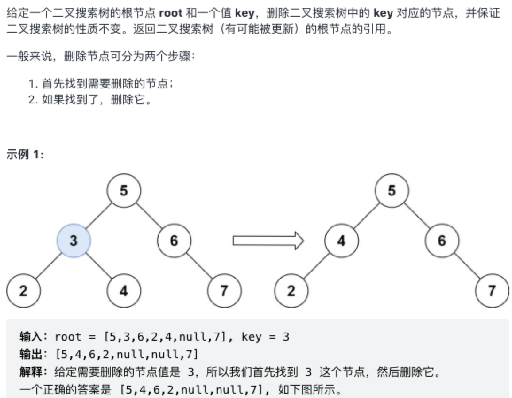

### 删除二叉搜索树中的节点

原题：https://leetcode-cn.com/problems/delete-node-in-a-bst/



#### 万能的递归模板

```js
/**
 * Definition for a binary tree node.
 * function TreeNode(val, left, right) {
 *     this.val = (val===undefined ? 0 : val)
 *     this.left = (left===undefined ? null : left)
 *     this.right = (right===undefined ? null : right)
 * }
 */
/**
 * @param {TreeNode} root
 * @param {number} key
 * @return {TreeNode}
 */
var deleteNode = function(root, key) {
    if (root === null) return null;
    if (root.val === key) {
        // 1. 如果没有左右子树，则删除当前节点即可
        if (root.left === null && root.right === null) return null;
        // 2. 如果只有一边子树，
        if (root.left !== null && root.right === null) return root.left; 
        if (root.left === null && root.right !== null) return root.right; 
        // 3. 最复杂的一种场景，有两种题解 
        // ① 在左子树中找最大值节点替换待删节点值，
        // ② 在右子树中找最小值节点替换待删节点值，
        // 最后再删除这个最大或最小节点即可
        if (root.left !== null && root.right !== null) {
            let node = getMinNode(root.right);
            root.val = node.val;
            root.right = deleteNode(root.right, node.val);
        } 
    } else if (root.val > key) {
        root.left = deleteNode(root.left, key);
    } else if (root.val < key) {
        root.right = deleteNode(root.right, key);
    }

    return root;
};

function getMinNode(root) {
    while (root.left !== null) {
        root = root.left;
    }

    return root;
}
```