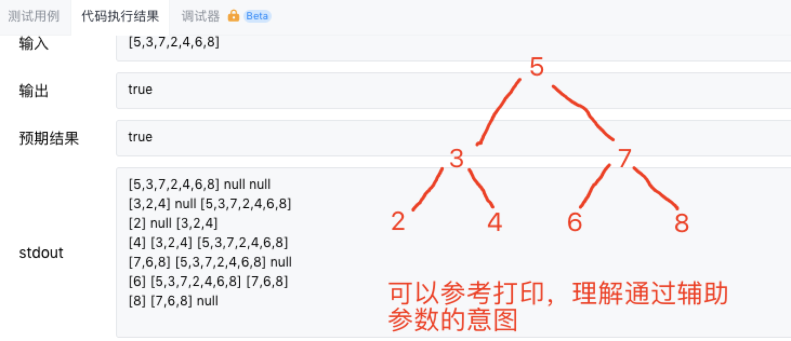

### 验证二叉搜索树

原题：https://leetcode-cn.com/problems/validate-binary-search-tree/

#### 递归

```js
/**
 * Definition for a binary tree node.
 * function TreeNode(val, left, right) {
 *     this.val = (val===undefined ? 0 : val)
 *     this.left = (left===undefined ? null : left)
 *     this.right = (right===undefined ? null : right)
 * }
 */
/**
 * @param {TreeNode} root
 * @return {boolean}
 */
var isValidBST = function(root) {
    return recurse(root, null, null);
};

function recurse(root, min, max) {
    if (root === null) return true;

    if (min !== null && root.val <= min.val) return false;
    if (max !== null && root.val >= max.val) return false;
    console.log(root, min, max);

    return recurse(root.left, min, root) && recurse(root.right, root, max);
}
```

