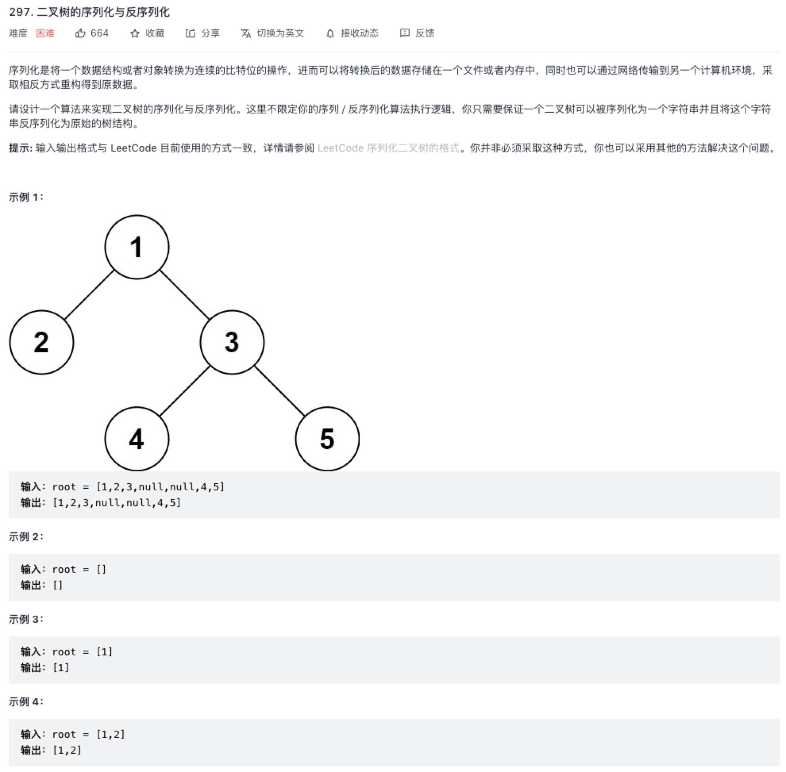

### 二叉树的序列化与反序列化

原题：https://leetcode-cn.com/problems/serialize-and-deserialize-binary-tree/



二叉树的遍历方式有哪些？
- 递归遍历方式有前序遍历，中序遍历，后序遍历；
- 迭代方式一般是层级遍历。

### 递归

递归的思路，即思考一个二叉树节点需要做什么，到底用什么遍历顺序，不需要跳入具体细节。

序列化直接代入遍历的框架即可：

```js
/**
 * Definition for a binary tree node.
 * function TreeNode(val) {
 *     this.val = val;
 *     this.left = this.right = null;
 * }
 */

/**
 * Encodes a tree to a single string.
 *
 * @param {TreeNode} root
 * @return {string}
 */
var serialize = function(root) {
    if (root === null) return '#';

    let left = serialize(root.left);
    let right = serialize(root.right);

    // let subTree = left + ',' + right + ',' + root.val;
    let subTree = root.val + ',' + left + ',' + right;

    return subTree;
};

反序列化最开始也没思路，看了一些题解，使用递归套路真的是无敌的存在。

只需找到跟节点（思考一个二叉树节点需要做什么），剩下的交给递归。

/**
 * Decodes your encoded data to tree.
 *
 * @param {string} data
 * @return {TreeNode}
 */
var deserialize = function(data) {
    let nodes = data.split(',');

    return _deserialize(nodes);
};

var _deserialize = function(nodes) {
    if (nodes.length === 0) return null;

    // let rootVal = nodes.pop();
    let rootVal = nodes.shift();

    if (rootVal === '#') return null;

    let root = new TreeNode(rootVal);

    // 前后续的遍历方式，这里调换位置
    root.left = _deserialize(nodes);
    root.right = _deserialize(nodes);

    return root;
}

/**
 * Your functions will be called as such:
 * deserialize(serialize(root));
 */
```

> 时间空间复杂度为 O(N)