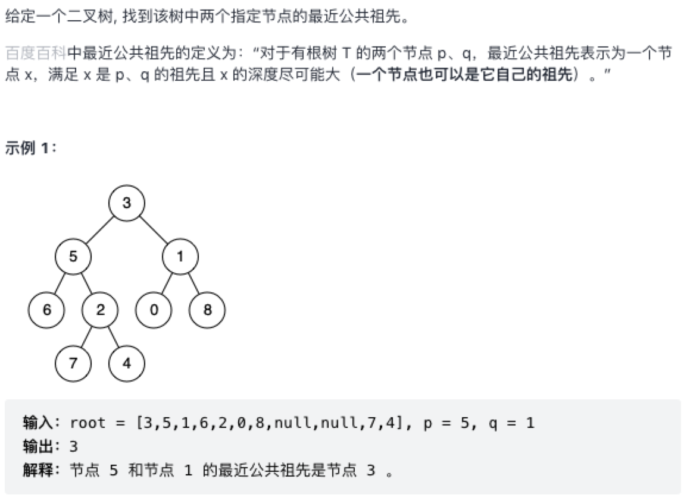

### 二叉树的最近公共祖先

原题：https://leetcode-cn.com/problems/lowest-common-ancestor-of-a-binary-tree/



#### 递归


```js
/**
 * Definition for a binary tree node.
 * function TreeNode(val) {
 *     this.val = val;
 *     this.left = this.right = null;
 * }
 */
/**
 * @param {TreeNode} root
 * @param {TreeNode} p
 * @param {TreeNode} q
 * @return {TreeNode}
 */
var lowestCommonAncestor = function(root, p, q) {
    // base case
    if (root === null) return null;
    // 如果遍历过程中，root 为其中一个值，则是目标解（从上到下）
    if (root === p || root === q) return root;

    // 通过遍历继续求结果
    let left = lowestCommonAncestor(root.left, p, q);
    let right = lowestCommonAncestor(root.right, p, q);

    // 后续遍历，即从下到上合并结果的过程，如果p、q不在跟节点，要分场景处理
    // ① 如果p、q分别在左右节点，则当前根节点为公共祖先节点
    if (left !== null && right !== null) return root;

    // ② 如果p、q均不在左右子树上，则在以该节点的树中，不存在公共祖先节点
    if (left === null && right === null) return null;

    // ③ 如果在某个分支节点上找到最近公共祖先节点，则直接返回
    return left == null ? right : left;
};
```