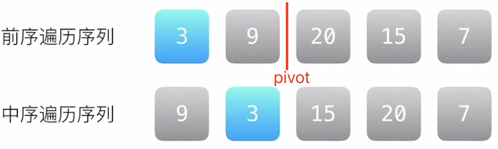

### 从前序与中序遍历序列构造二叉树

原题：https://leetcode-cn.com/problems/construct-binary-tree-from-preorder-and-inorder-traversal/

根据一棵树的前序遍历与中序遍历构造二叉树。

注意: 你可以假设树中没有重复的元素。

例如，给出

前序遍历 preorder = [3,9,20,15,7]
中序遍历 inorder = [9,3,15,20,7]
返回如下的二叉树：
```
    3
   / \
  9  20
    /  \
   15   7
```

> 快速记忆法：
> 前序就是父节点->左子树->右子树，中序是左子树->父节点->右子树，后序是左子树 -> 右子树 ->父节点

#### 递归

递归算法的实质是把问题分解成小规模的同类问题，这些同类问题作为子问题递归调用来表示问题的解。

前序遍历的第一个元素一定是根节点，由于树中没有重复的元素，因此可以迭代的计算出中序遍历的根节点位置。

> 为了后续的递归更加方便获取中序遍历的根节点，可将中序遍历的元素和位置 HashMap 一下。

1) 将问题分解为几个子问题，大致如下：


可以肯定的是元素 3 为根节点的值。

假设，前序遍历的第一个、最后一个元素分别为 preLeft、 preRight，中序遍历的第一个、最后一个元素分别为 inLeft、 inRight

通过 hashMap 的对照关系，可以获取到中序遍历根节点的位置，

即 inRoot = map.get(preorder[preLeft])，那么中序遍历就可以分解为如上图的 [9][3][15 20 7]，

即 `[ [左子树的中序遍历结果], 根节点, [右子树的中序遍历结果] ]`，到目前为止，将问题进行了拆分。

**如何拆分前序遍历呢？**

一个关键点是，前序和中序的根节点左右子树的个数一定相等，那么，前序遍历根节点的左右子树边界 pivot - preLeft = inRoot - inLeft

根据 pivot 分解为如上图的 [3][9][20 15 7]，即 `[ 根节点, [左子树的前序遍历结果], [右子树的前序遍历结果] ]`

1) 寻找递归出口

当递归到任何一个叶子节点，它的 preLeft = preRight = preRoot = inRoot = inLeft = inRight，叶子节点没有子节点，所以返回 null 即可。

```js
/**
 * Definition for a binary tree node.
 * function TreeNode(val, left, right) {
 *     this.val = (val===undefined ? 0 : val)
 *     this.left = (left===undefined ? null : left)
 *     this.right = (right===undefined ? null : right)
 * }
 */
/**
 * @param {number[]} preorder
 * @param {number[]} inorder
 * @return {TreeNode}
 */
var buildTree = function(preorder, inorder) {
    let len = inorder.length; // 前中后序数组长度是一样的
    let map = new Map();
    for (let i = 0; i < len; i++) {
        map.set(inorder[i], i);
    }

    function _buildTree(pLeft, pRight, inLeft, inRight) {
        // 递归出口
        if (pLeft > pRight) {
            return null;
        }
        
        let pRoot = pLeft;
        let rootNode = new TreeNode(preorder[pRoot]);
        let inRoot = map.get(preorder[pRoot]);

        // pivot - pLeft = inRoot - inLeft
        let pivot = pLeft + inRoot - inLeft;  

        // recursion
        rootNode.left = _buildTree(pLeft + 1, pivot, inLeft, inRoot - 1);
        rootNode.right = _buildTree(pivot + 1, pRight, inRoot + 1, inRight);

        return rootNode; 
    }
  
    return _buildTree(0, len - 1, 0, len - 1);
};
```

> 时间\空间复杂度：O(n)，其中 n 是树中的节点个数。
> 空间复杂度除去返回的答案需要的 O(n) 空间之外，还需要 O(n) 的空间存储哈希映射。