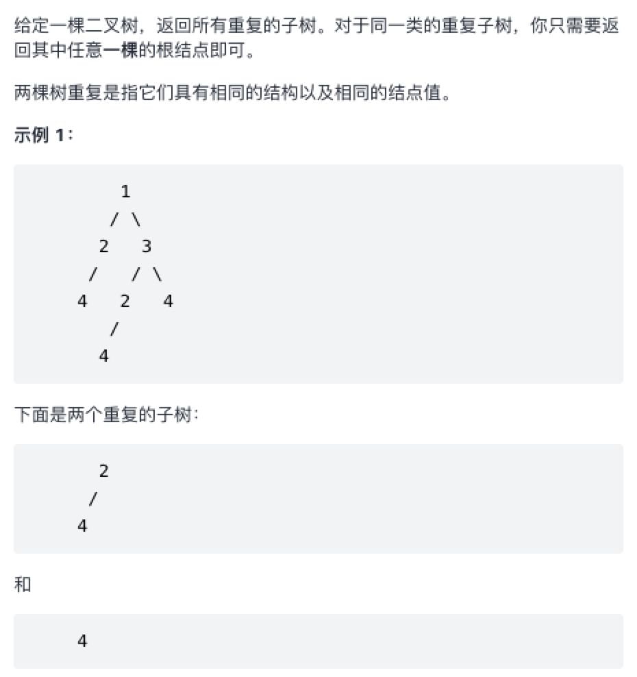

### 寻找重复的子树

原题： https://leetcode-cn.com/problems/find-duplicate-subtrees/



#### 递归 + 序列化

```js
/**
 * Definition for a binary tree node.
 * function TreeNode(val, left, right) {
 *     this.val = (val===undefined ? 0 : val)
 *     this.left = (left===undefined ? null : left)
 *     this.right = (right===undefined ? null : right)
 * }
 */
/**
 * @param {TreeNode} root
 * @return {TreeNode[]}
 */
var findDuplicateSubtrees = function(root) {
    let map = new Map();
    let res = [];

    function sequence(root) {
        if (root === null) return '#';

        let left = sequence(root.left);
        let right = sequence(root.right);

        let subTree = left + ';' + right + ';' + root.val;

        map.set(subTree, (map.get(subTree) || 0) + 1);

        if (map.get(subTree) === 2) res.push(root);

        return subTree;
    }

    sequence(root);

    return res;
};


```