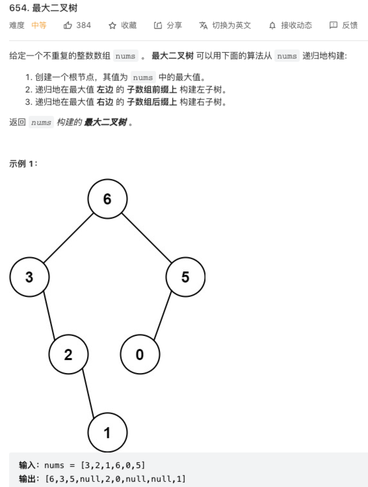

### 最大二叉树

原题：https://leetcode-cn.com/problems/maximum-binary-tree/



### 递归

对于构造二叉树的问题，先思考如何构造根节点。

接下来，对于每个根节点，只需要找到当前 nums 范围内的最大值及其索引，然后递归调用左右数组构造左右子树即可。

```js
/**
 * Definition for a binary tree node.
 * function TreeNode(val, left, right) {
 *     this.val = (val===undefined ? 0 : val)
 *     this.left = (left===undefined ? null : left)
 *     this.right = (right===undefined ? null : right)
 * }
 */
/**
 * @param {number[]} nums
 * @return {TreeNode}
 */
var constructMaximumBinaryTree = function(nums) {
    return build(nums, 0, nums.length - 1);
};

function build(nums, left, right) {
    if (left > right) return null;

    let maxNum = -Infinity;
    let index = 0;
    for (let i = left; i <= right; i++ ) {
        if (nums[i] > maxNum) {
            maxNum = nums[i];
            index = i;
        }
    }

    let root = new TreeNode(maxNum);
    root.left = build(nums, left , index - 1);
    root.right = build(nums, index + 1 , right);

    return root;
}
```

> 时间复杂度为 O(n²)，即递归调用 build n 次，找数组最大值 n 次；