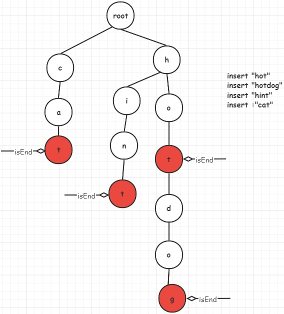
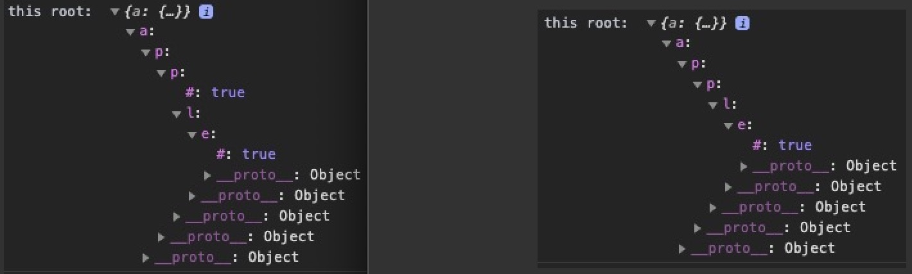

### 字典树（前缀树）

字典树，又称前缀树，是 N 叉树的特殊形式，常用来存储字符串。

前缀树的每一个节点代表一个字符串（前缀），每一个节点会有多个子节点，通往不同子节点的路径上有着不同的字符。

子节点代表的字符串是由节点本身的原始字符串 ，以及通往该子节点路径上所有的字符组成的。

前缀树的一个重要的特性是，节点所有的后代都与该节点相关的字符串有着共同的前缀。

#### 字典树的特点：
- Trie 树是一个有根的树；
- 每个节点对应多个子节点（如，最多 26 个字母），对应字母表数据集中的一个字母；
- 布尔字段，以指定节点是对应键的结尾还是只是键前缀。

#### 举个例子：
Trie 树中最常见的两个操作是键的插入和查找，通过下图来理解一下，



##### 1）向 Trie 树中插入键
插入某个字符串，我们一般是遍历该字符串并从根开始搜索它对应于第一个键字符的链接（即该 key 值在某个节点是否存在），有两种情况：
- 链接存在，当前 node 即沿着链接移动到树的下一个子层；
- 链接不存在，创建一个新的节点；
- 重复以上步骤，直到到达键的最后一个字符，然后将当前节点标记为结束节点。

如上提，当插入一个字符串`cat`，优先从根节点开始搜索，如果当前节点无字符 `c`，则创建之，否则，当前节点替换为该节点。

##### 2）于 Trie 树中搜索字符串
对于搜索，每个键在 trie 中表示为从根到内部节点或叶的路径。
我们用第一个键字符从根节点开始搜索，检查当前节点中与键字符对应的链接（即该 key 值在某个节点是否存在），也有两种情况：
- 存在该链接（key 值存在），当前 node 即沿着链接移动到树的下一个子层，并继续搜索下一个键字符，搜索到若已无键字符，且当前结点标记为 isEnd，则返回 true，白话一点就是待搜索的字符，沿着根节点搜索，恰好其最后一个字符与该树的某条链路一样，且最后一个字符对应 key 被标记位 isEnd；
- 否则返回 false。

### 实现 Trie (前缀树)
原题：https://leetcode-cn.com/problems/implement-trie-prefix-tree/

Trie（前缀树)是一种树形数据结构，用于高效地存储和检索字符串数据集中的键。这一数据结构有相当多的应用情景，例如自动补完和拼写检查。

请你实现 Trie 类：
```
Trie() 初始化前缀树对象。
void insert(String word) 向前缀树中插入字符串 word。
boolean search(String word) 如果字符串 word 在前缀树中，返回 true（即，在检索之前已经插入）；否则，返回 false。
boolean startsWith(String prefix) 如果之前已经插入的字符串 word 的前缀之一为 prefix，返回 true；否则，返回 false。
```

```js
/**
 * Initialize your data structure here.
 */
var Trie = function() {
  this.root = Object.create(null);
  this.end = '#';
};

/**
 * Inserts a word into the trie. 
 * @param {string} word
 * @return {void}
 */
Trie.prototype.insert = function(word) {
  let cur = null;
  let node = this.root;
  for (let i = 0; i < word.length; i++) {
    cur = word[i];
    if (!(cur in node)) {
      node[cur] = {};
    }
    node = node[cur];
  }
  node[this.end] = true;
};

/**
 * Returns if the word is in the trie. 
 * @param {string} word
 * @return {boolean}
 */
Trie.prototype.search = function(word) {
  let cur = null;
  let node = this.root;
  for (let i = 0; i < word.length; i++) {
    cur = word[i];
    if (cur in node) {
      node = node[cur];
    } else {
      return false;
    }
  }
  return this.end in node;
};

/**
 * Returns if there is any word in the trie that starts with the given prefix. 
 * @param {string} prefix
 * @return {boolean}
 */
Trie.prototype.startsWith = function(prefix) {
  let cur = null;
  let node = this.root;
  for (let i = 0; i < prefix.length; i++) {
    cur = prefix[i];
    if (cur in node) {
      node = node[cur];
    } else {
      return false;
    }
  }
  return true;
};

/**
 * Your Trie object will be instantiated and called as such:
 * var obj = new Trie()
 * obj.insert(word)
 * var param_2 = obj.search(word)
 * var param_3 = obj.startsWith(prefix)
 */
```

如依次插入 apple 和 app 后的结果：
